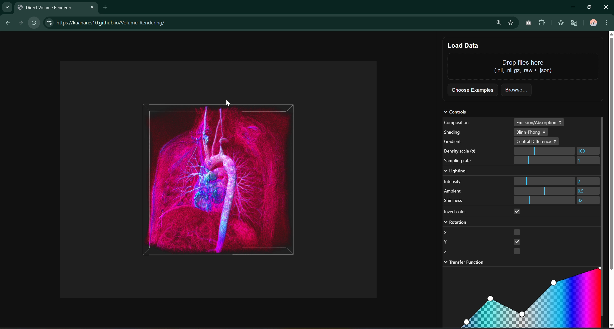

# Direct Volume Renderer 

An interactive web-based **Direct Volume Rendering (DVR)**

It supports medical and scientific datasets (`.nii`, `.nii.gz`,  `.raw + .json`), with shading, transfer functions, multiple rendering modes.

## Video
https://github.com/user-attachments/assets/39fb1a86-e2f1-4283-bd13-cd12a19b9334

---

**Project Website:** [https://kaanares10.github.io/Volume-Rendering](https://kaanares10.github.io/Volume-Rendering)

  

Transfer function editor components are adapted from  
  [DLR-SC/transfer-function-editor](https://github.com/DLR-SC/transfer-function-editor)
